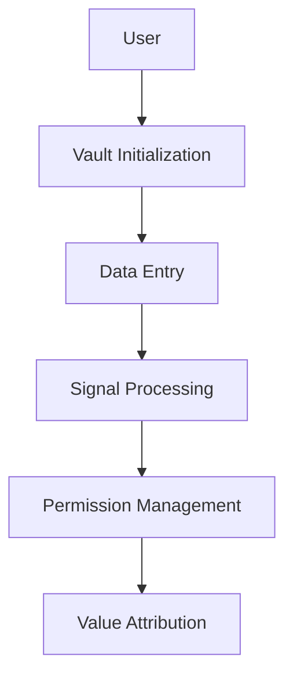

# 🪪 The VAULT

The Vault is the foundation of Y — a structured, sovereign, intelligent container for everything a human is, does, and chooses to share.

> 💫 It's not just data storage. It's the record of a life. A system that turns identity, behavior, and context into usable, valuable signal — owned and controlled by the individual.

---

## 🧠 What the Vault Stores

Each Vault contains encrypted, structured data including:

| Category | Description |
|----------|-------------|
| 🧩 **Cognitive Patterns** | Attention maps, focus cycles |
| 🎭 **Emotional & Mental State** | Mood tracking, therapy notes, journaling |
| 💪 **Biometric Health** | Sleep data, HRV, cycle tracking, Apple Health |
| 📊 **Behavioral Metadata** | App usage, location, habits |
| 💬 **Language & Expression** | Messages, speech cadence, writing style |
| 🌐 **Social Context** | Network graph, communication tone |
| 📚 **Learning & Productivity** | Tasks, corrections, memory logs |
| ✨ **Voluntary Reflections** | Dreams, goals, voice notes |

This is **your life** — compressed, permissioned, and owned.

---

## 🔐 Why It Matters

Without the Vault, there is no sovereignty in the AI era.

Big systems are already extracting behavioral signal at scale. But they do it **without consent, attribution, or economic return**. The Vault flips this model:

- ✅ You choose what goes in
- 👁️ You see who's requesting what
- 💰 You get paid for your contribution
- 🔒 You can revoke access at any time

---

## 🛠 How It Works (High-Level)

- Vaults are initialized per user with a unique ID
- All entries are time-stamped and schema-aligned
- Permissions are enforced via the Human API
- Raw inputs are processed into structured formats by the Signal Layer
- Usage logs and attribution are recorded by the Grid

---

## 🔄 Connected Layers

| Layer | Role | Icon |
|-------|------|------|
| **Echo** | Your personal AI. Not just a voice — a mirror. It knows you better than anyone. It grows with you, protects you, and speaks *as you*, not just *for you* | 🤖 |
| **Signal** | Interprets raw input into structured, valuable data | 📡 |
| **API** | Manages permissioned access to the Vault | 🔑 |
| **Grid** | Tracks usage, attribution, and value routing | 📊 |
| **MCP** | Provides memory context to agents and models | 🧠 |

---

## 🧭 Why This Folder Exists

This folder contains all logic related to Vault initialization, input intake, schema definitions, encryption, permissions, and user-facing metadata.

> 💫 Giving humans a place to stand — and a voice in systems that currently treat them like shadows.

---

