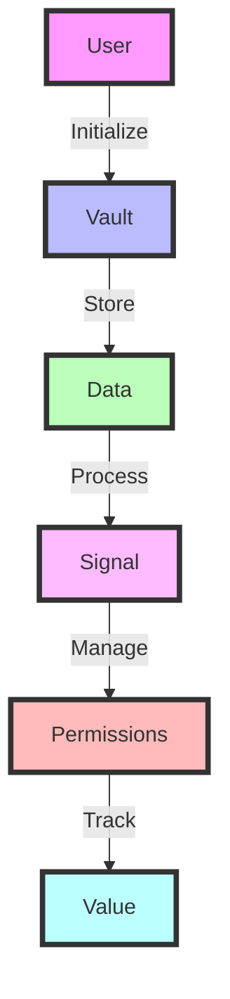

# 🪪 The VAULT

## 🌟 Introduction

The Vault is the foundation of Y — a structured, sovereign, intelligent container for everything a human is, does, and chooses to share.

> 💫 It's not just data storage. It's the record of a life. A system that turns identity, behavior, and context into usable, valuable signal — owned and controlled by the individual.

---

## 🧩 Schema Registry & Extensibility

The Vault is powered by a dynamic **schema registry**. This means:
- Any data type (health, behavioral, creative, etc.) can be added without code changes
- Each data entry references a schema (with versioning) for structure and UI rendering
- The dashboard and Echo adapt automatically to new data types

Developers and users can extend the Vault by registering new schemas, which describe fields, units, display names, and UI hints.

---

## 💸 Value Calculation & Vault Score

Your Vault's value is calculated using:
- **Demand**: How many requests exist for this data type?
- **Rarity**: Is your data common or unique?
- **Completeness/Quality**: How detailed and well-structured is your data?
- **Freshness**: Is your data recent?
- **Signal Density**: Richness of behavioral/emotional/other signals
- **Streaks & Decay**: Consistent uploads are rewarded, outdated data loses value

Your **Vault Score** and earning potential are shown in the dashboard, with tips to increase your value.

---

## 🛠 How to Add New Data Types (for Developers)

1. **Register a Schema**: Add a new entry to the `schema_registry` table with:
   - `type` (e.g. "blood_test")
   - `display_name` (e.g. "Blood Test")
   - `version` (start with 1)
   - `fields` (JSON array: name, type, unit, etc.)
   - `category`, `visibility`, `ui_widget_hint`
2. **Ingest Data**: Add entries to `vault_entries` referencing the new schema type and version.
3. **UI/AI Adaptation**: The dashboard and Echo will automatically recognize and render the new data type.

---

## 🧠 What the Vault Stores

Each Vault contains encrypted, structured data including:

| Category | Description | Icon |
|:--------:|:------------|:----:|
| 🧩 **Cognitive Patterns** | Attention maps, focus cycles |  |
| 🎭 **Emotional & Mental State** | Mood tracking, therapy notes, journaling |  |
| 💪 **Biometric Health** | Sleep data, HRV, cycle tracking, Apple Health |  |
| 📊 **Behavioral Metadata** | App usage, location, habits |  |
| 💬 **Language & Expression** | Messages, speech cadence, writing style |  |
| 🌐 **Social Context** | Network graph, communication tone |  |
| 📚 **Learning & Productivity** | Tasks, corrections, memory logs |  |
| ✨ **Voluntary Reflections** | Dreams, goals, voice notes |  |

> 🔐 This is **your life** — compressed, permissioned, and owned.

---

## 🔐 Why It Matters

Without the Vault, there is no sovereignty in the AI era.

Big systems are already extracting behavioral signal at scale. But they do it **without consent, attribution, or economic return**. The Vault flips this model:

| Feature | Description | Icon |
|:--------|:------------|:----:|
| ✅ **Choice** | You choose what goes in |  |
| 👁️ **Transparency** | You see who's requesting what |  |
| 💰 **Value** | You get paid for your contribution |  |
| 🔒 **Control** | You can revoke access at any time |  |

---

## 🛠 How It Works

- Vaults are initialized per user with a unique ID
- All entries are time-stamped and schema-aligned
- Permissions are enforced via the Human API
- Raw inputs are processed into structured formats by the Signal Layer
- Usage logs and attribution are recorded by the Grid

---

## 🔄 Connected Layers

| Layer | Role | Icon | Status |
|:-----:|:-----|:----:|:------:|
| **Echo** | Your personal AI. Not just a voice — a mirror. It knows you better than anyone. It grows with you, protects you, and speaks *as you*, not just *for you* | 🤖 |  |
| **Signal** | Interprets raw input into structured, valuable data | 📡 |  |
| **API** | Manages permissioned access to the Vault | 🔑 |  |
| **Grid** | Tracks usage, attribution, and value routing | 📊 |  |
| **MCP** | Provides memory context to agents and models | 🧠 |  |

---

## 🧭 Why This Folder Exists

This folder contains all logic related to Vault initialization, input intake, schema definitions, encryption, permissions, and user-facing metadata.

> 💫 Giving humans a place to stand — and a voice in systems that currently treat them like shadows.

---

## 🌟 Features

---

## 📊 Tech Stack

---

## 🧩 Building Vault-Native Modules (For Developers)

Y is not a platform for launching new, standalone apps. Instead, developers build Vault-native modules—dashboards, agents, plugins, and tools that run inside the Vault interface, under user control.

**All modules:**
- Run inside the Vault (the user's trusted home and OS)
- Use Y's schema registry and data standards
- Respect user consent and value-routing protocols
- Are reviewed, authenticated, and optionally monetized through Y
- Are always visible, revocable, and permissioned by the user

### Examples of Vault-Native Modules
- Health, habit, or learning dashboards
- AI agents trained on Vault data
- Research request layers (with user consent)
- Simulation tools, coaching layers, family/collaborative views
- Plugins that extend Echo's capabilities

### How to Build a Module
1. Register your module with the Vault (schema, permissions, UI integration)
2. Use Y's APIs and schema registry for data access (with consent)
3. Follow all consent, privacy, and value-routing protocols
4. Submit for review/authentication
5. Optionally monetize through Y's value-routing engine

**You do not build standalone apps. You build modules that live inside the Vault.**